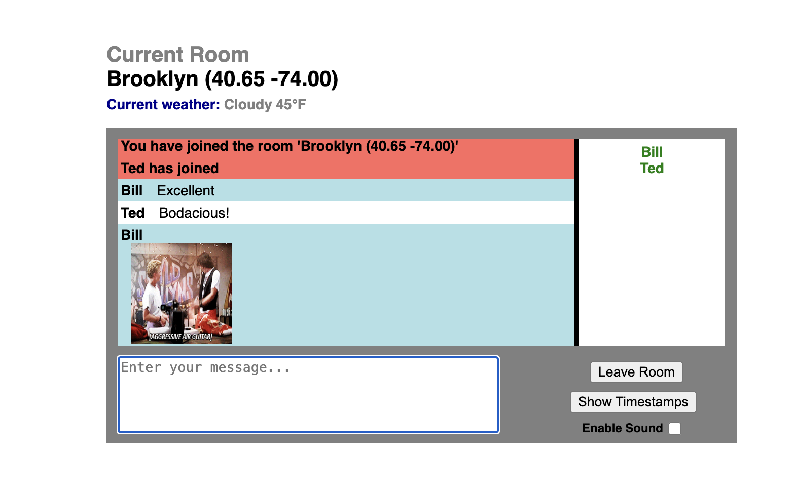

# GPSChat



GPSChat is a location-based real-time chat app built with Node.js + Socket.IO.

Users are grouped into rooms based on their GPS coordinates. If no nearby room exists, a new one is created. If a room reaches capacity, room assignment becomes more geographically specific (progressive granularity) so dense areas split into closer sub-rooms.

## Features

- Real-time chat via WebSockets (Socket.IO)
- GPS-based room assignment
- Progressive room granularity when rooms are full
- Join/leave notifications (including browser/tab close disconnects)
- Typing indicators
- Inline image command (`/img <url>`)
- Weather display for your location

## Local Development

Requirements:
- Node.js 18+ (tested on modern Node)

Run:

```bash
npm install
node app.js
```

Open:
- `http://localhost:3000`

To test multiple users locally:
- Open in two browsers (or one browser + incognito)
- Use different usernames
- Allow geolocation in both windows

## Deployment (Cheapest + Easiest)

Recommended host: Render web service (supports WebSockets).

- Docs: https://render.com/docs/websocket
- Free tier available, but paid instance is better for live demos (no sleep/cold start).

### Render Setup

- Runtime: `Node`
- Build Command: `npm install`
- Start Command: `node app.js`
- Port: use platform-assigned `PORT` (already supported by app)
- Instance count: `1` (important: room state is in-memory)

## Docker

A Dockerfile is included, but if you use Render, direct Node runtime deployment is simpler.

## Notes

- Room/messages state is in-memory only (restarts clear state).
- Geolocation quality depends on browser permissions and device/location accuracy.
